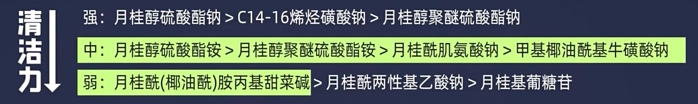
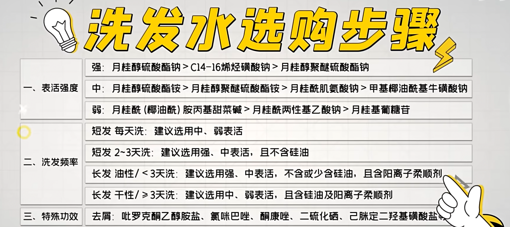

词条目为洗发水选购指南

先有的产品，才有的发质。所以根据头发的长短来选择。

## 短发

### 每天洗

产品配方第二位是（第一位一般是水）中、弱清洁力的洗发水

- 月桂醇XX铵
- XXXX牛磺酸钠
- 月桂酰肌氨酸钠
- 月桂酰胺丙基甜菜碱

大多男士洗发水，第二位一般是月桂醇聚醚硫酸酯钠，清洁力很大，不能每天用。因为洗得越干净，你头皮“反馈调节”就会分泌越多的油。

### 2～3天洗

月桂醇聚醚硫酸酯钠+椰油酰胺丙基甜菜碱（高、中清洁力）的<u>无硅油</u>（不含[XXXX硅XXX]）洗发水

### 2～3天洗+头屑多

产生头屑的机制原理：头油过多，马拉色菌“啃食”头皮导致。

选择清洁力更强的：

- 月桂醇硫酸酯钠
- C14-16烯烃磺酸钠

去油（断掉马拉色菌的食物来源）的同时，添加吡罗克酮乙醇胺盐（攻击其本体）

## 长头发

暂时不打算留

