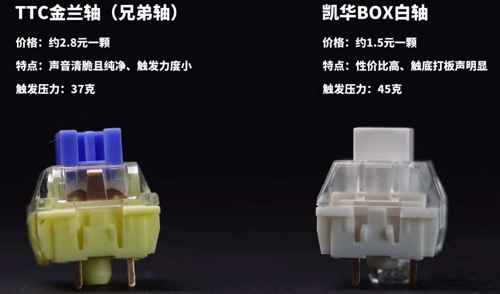
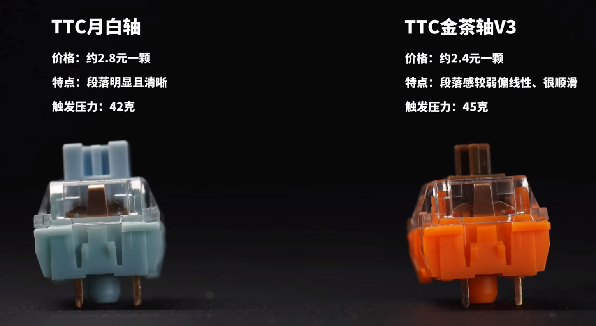
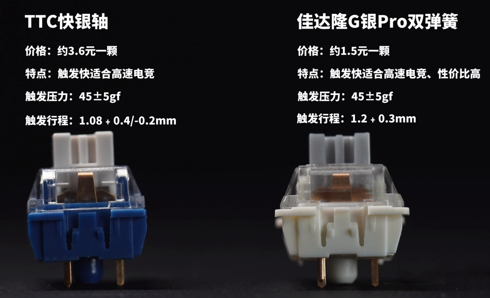
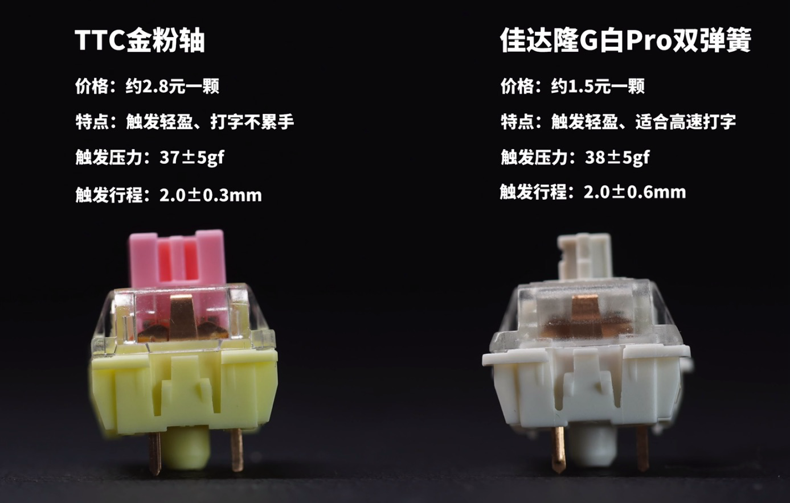
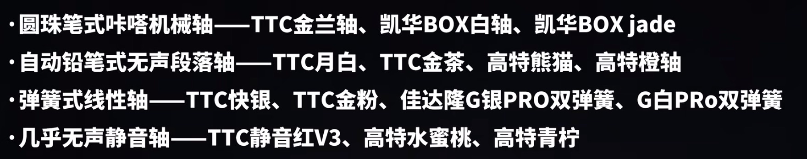
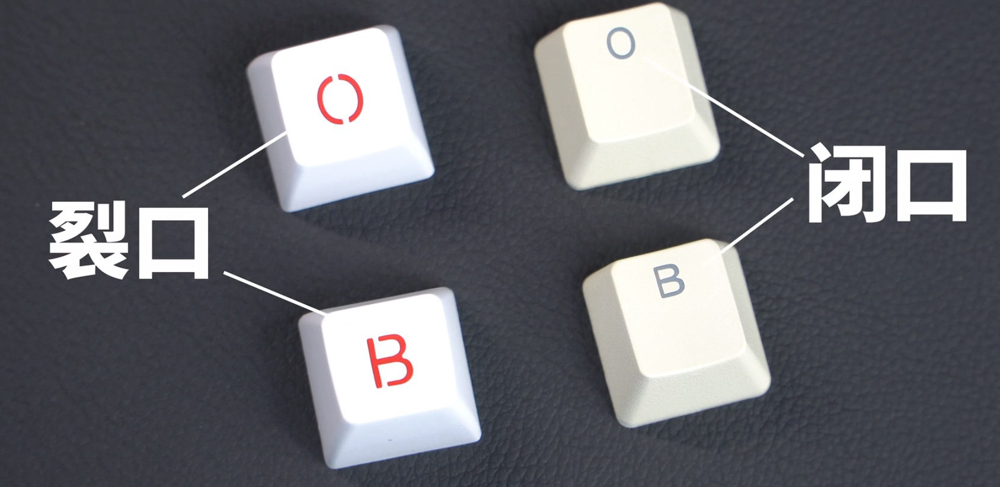
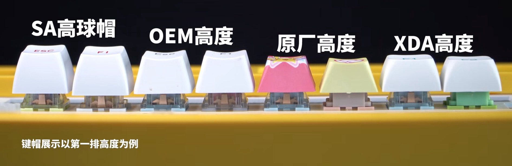

## 机械键盘打油保养方案

​	拿湿润的毛巾（拧干水后），擦洗断电后的键盘，如果有条件，可以用吹风机烘干。

## 机械键盘选购指南

​	目前在用的是keychorn k3 青轴，京东京造代理。缺点是青轴声音太吵，电量少，容易打油。优点是很轻巧，矮轴，打久了手背不会太累。

​	突然想到可以把这个键盘的打字区的轴给替换掉不就好了吗？只可惜不支持换轴。于是我打算把静音的机械键盘轴和键帽都换了。

## 薄膜键盘选购指南

​	目前在用的是罗技mx keys 商用版。总觉得手感软绵绵的，也有些容易打油，但之前印象中又比机械键盘舒服。

## 客制化键盘

​	目前在用的是淘宝定制的水蜜桃静音轴，手感有些软绵绵的，缺少功能键，打久了手背还有些酸。不过好处是十分静音。

​	最近有点喜欢麻将音的键盘声，青轴带到学校去实在有点不合适，但我学校里都放了两把键盘了。最多添一把轻薄的机械键盘麻将音的，如果可以客制化的话就更好了，不知道500以内能不能搞下来。

​	套件+机械轴+键帽

### 套件

​	套件：外壳+电路板+辅助消音减震的硅胶垫+固定轴体的定位板

#### 外壳

​	白色外壳比较百搭，可搭配各种浅色的键帽，小清新风格

​	黑色外壳搭配深色键帽

​	彩色外壳搭配同色系的键帽

​	高端外壳：金属、木质（适合对品质要求高的人）

#### 电路板

​	负责键盘的各项功能。

​	**连接方式：**

- 有线 效果最好
- 蓝牙 省电，但质量一般
- 2.4G连接（bios可用，比蓝牙稳定）

​	主流套件都支持三模连接，可以优先考虑。

​	电路板还负责键盘灯光部分。主流套件将灯珠装在了电路板上，可以通过驱动软件自定义灯光效果。建议选有灯光的。

#### 键位

​	64键紧凑型布局，适合只打字的，功能键缺失，我是不会选择的。

​	总之挑自己用起来最舒服的按键配列。我应该会选择和我keychorn差不多的配列，MX keys的太宽了。

### 机械轴

​	决定按键手感最重要的部分。

根据手感不同可大致分为4类：

- 圆珠笔式咔嗒机械轴（就类似青轴这种，噼里啪啦很爽的感觉）可以给到一些专有键

- 自动铅笔式无声段落轴

- 弹簧式线性轴

适合常用游戏按键，wsad之类的

- 几乎无声静音轴

这个暂时不考虑，因为已经有了。

### 键帽

​	根据按键配列选择合适的键帽。

​	如果是紧凑型套件，就需要避免传统的87键和104键的键帽，尽量选择支持多种配列的全套或小全套键帽。

​	选键帽主要关注键帽的材质，图案和字符的工艺，以及键帽高度。

#### 材质

​	主流是ABS和PBT（有磨砂质感）。

​	前者比较软，手感细腻，温润如玉，缺点是容易打油。

​	后者硬，磨砂质感，不易脏，不易沾手汗，耐磨。但是打字手感不如前者。

#### 工艺

​	热升华工艺：有各种彩色图案。它上面的图案其实是用高温把颜料渗透进键帽中形成的。多用于PBT材质。热升华键帽都不透光。

​	双色注塑工艺：可以透光。把两种不同颜色的材料压制在一起，利用色差显示出字符。可以关注字符是裂口还是闭口。

​	裂口工艺难度低，更便宜。

​	激光刻蚀（镭雕）：用激光在键帽上灼烧出凹槽形成字符。这种字符寿命一般，成本低，不耐磨，不推荐购买。除非是侧刻的字符，因为摸不到。

#### 高度

​	一般是OEM高度（高2mm）和原厂高度（cherry键帽高度）

​	

我的静音键盘就是XDA，没有前凸，中凹，后翘的人体工学设计

### 优化细节

#### 卫星轴

​	价格比较低的套件都要对大键卫星轴做适当调教。如果大键（比如空格）杂音多，按键松垮就要调教。我们要做的就是尽量减少晃动和杂音。需要取下卫星轴，买上润滑脂和特氟龙胶带，都很便宜。详情可以看[原视频](https://b23.tv/a0FzH5r])。

### 选购过程

​	选来选去还是b站上的靠谱一些，因为我就想要麻将音，直接检索就有很多教程。于是我买了推荐的轴体，才几毛钱一颗，先试试看吧，也算是入门了。键帽我选择了侧刻的，OEM高度的，不知道会不会太高了，之后用着不爽的话，再配个矮点的，再选个全铝的套件，配上静音轴？这样搭配感觉一般，之前影响静音轴的手感感觉还是键帽占大头。键帽还是之前买客制化键盘的那家，还挺贵的，150左右买的。

​	最后我买了个好点的拔键器拔轴器二合一，花了将近20块。

​	航插线还是有点贵，都够我买一套好键帽了，没舍得买，最主要还因为不是刚需。

​	下次可以买一套设计师的键帽，我也挺喜欢的。